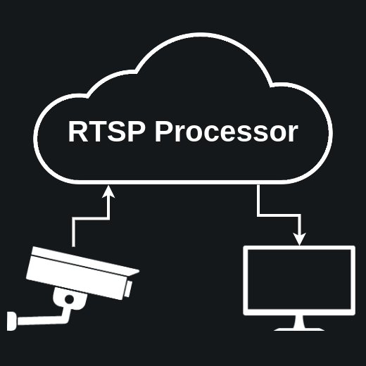

# RTSP Processor



This work contains the required scripts to listen to a Real-Time Streaming Protocol feed, modify it, and publish a new stream. This is a commonly required functionality in real-time inferencing scenarios.

# Installation

This work depends on Mediamtx [[1](https://github.com/bluenviron/mediamtx)], OpenCV [[2](https://github.com/opencv/opencv)], and optionally FFmpeg [[3](https://ffmpeg.org/)]. Mediamtx is required as the RSTP server. OpenCV is used for reading the raw RSTP stream. To write a new stream, the user has the flexibility to select between OpenCV or FFmpeg. If the user intends to use OpenCV for streaming, they must compile OpenCV from the source with GStreamer enabled.

If the user intends to use FFmpeg, they may simply create the environment from the `environment.yaml` file, and then download the required binaries for Mediamtx from the official source. The steps are provided in the `install.sh` file. To install OpenCV with GStreamer, simply invoke the `install.sh` script with bash.

```bash
bash ./install.sh
```

It can be verified that the OpenCV installation has GStreamer enabled. This can be found using the following command.

```bash
python3 -c 'import cv2; print(cv2.getBuildInformation())' | grep GStreamer
```

**Note: This script is prepared and tested on an Ubuntu 22.04 system. The exact steps might change based on your operating system. Please refer to the official documentation in case of failure.**

# Usage

To use this setup, you must have access to an RTSP stream, which needs to be processed. For quick setup and evaluation, the `src/helpers/mockstream.py` script is provided.

Also to stream from your computer, an RTSP server must be up and running. We will be using Mediamtx (formerly rtsp-simple-server) for this.

## Mock Setup Steps

Each of the following should run on its own shell or in the background concurrently.

1. Start the RSTP server: Use the `mediamtx` executable.

```bash
./mediamtx
```

2. Start the _mockstream_ using the `src/helpers/mockstream.py` script. This script streams a set of images in a directory in a loop, sorted according to the file name.

```bash
python  src/helpers/mockstream.py --image-dir /path/to/your/images
```

3. Start the processor

```bash
python main.py
```

## Editing the Configuration

Once it is verified that the mock setup is working correctly, the user may edit the `config.yaml` definition per requirement.

# References

1. Mediamtx: [https://github.com/bluenviron/mediamtx](https://github.com/bluenviron/mediamtx)
2. OpenCV:[https://github.com/opencv/opencv](https://github.com/opencv/opencv)
3. FFmpeg: [https://ffmpeg.org/](https://ffmpeg.org/)
